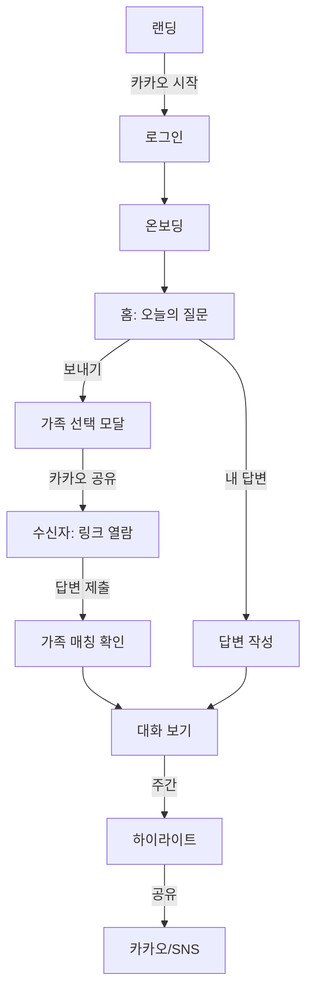
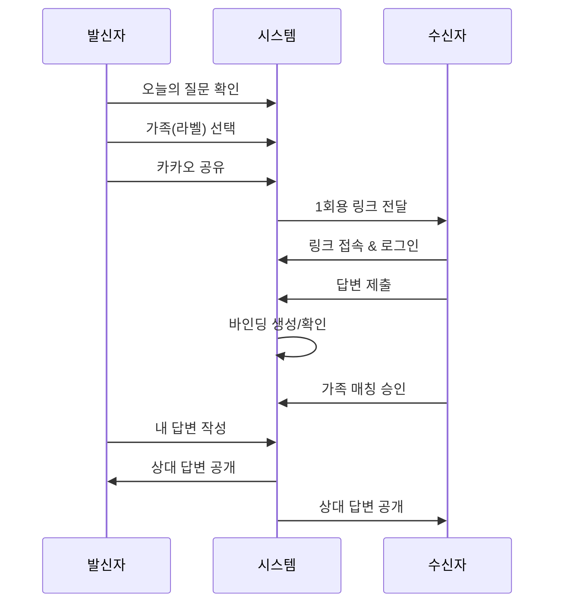
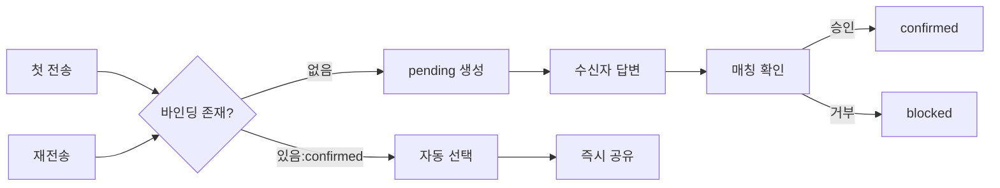

# 마음배달 PRD

## 0) Executive Summary

### 문제 정의 및 기회

한국 가족의 소통 단절 문제가 심각하다. 성인 자녀는 부모와 주 2.2회만 통화하며, 매일 대화하고 싶어도 무엇을 말해야 할지 모르는 상황이다. 60대 이상 스마트폰 보유율이 96%에 달하는 현실에서, 카카오톡 기반의 가벼운 일일 대화 서비스가 해결책이 될 수 있다.

### 핵심 가치 제안

**"매일 하나의 질문으로 가족의 마음을 배달합니다"**

- 카카오톡 기반으로 앱 설치 없이 즉시 시작
- 가족 단위로 유연한 전송 (엄마/아빠/할머니 등 라벨 선택)
- 본인 답변 후 상대 답변 열람으로 진정성 확보
- 주간 하이라이트로 추억 축적

### 핵심 설계 선택

1. **카카오 로그인**: 별도 회원가입 없이 즉시 시작
2. **세션 가드**: `/login` + `returnTo`로 끊김 없는 복귀
3. **라벨 기반 전송**: 페어링 없이 가족 선택하여 전송
4. **1회용 링크 토큰**: 보안과 신뢰성 확보
5. **자동 바인딩**: 첫 답변 후 자동으로 가족 연결 기록
6. **자기표현 게이트**: 내 답변 먼저 작성해야 상대 답변 열람
7. **주간 하이라이트**: 일주일 대화를 아름답게 정리

## 1) 목표 및 성공 지표

### 제품 목표

- **습관 형성**: 가족과의 일일 대화를 자연스러운 루틴으로 정착
- **정서적 연결**: 세대 간 이해와 공감대 형성
- **지속 가능한 성장**: 바이럴을 통한 자연스러운 확산

### 핵심 KPI

| 지표 | 목표치 | 측정 방법 |
| --- | --- | --- |
| **D0 Aha Moment** | ≥ 60% | 로그인 후 10분 내 전송 완료 또는 답변 제출 |
| **전송→답변 도달률** | ≥ 45% | `send_share_complete` → `receiver_answer_submit` |
| **2주 내 동일 가족 재사용률** | ≥ 40% | 같은 라벨로 재전송한 사용자 비율 |
| **주간 하이라이트 공유율** | ≥ 10% | 생성된 카드 중 외부 공유 비율 |
| **30일 리텐션** | ≥ 25% | MAU/신규가입자 |

### 비즈니스 가설

- 페어링 없는 라벨 모델이 **진입장벽을 50% 감소**시켜 초기 전환율 향상
- 자동 바인딩이 **반복 사용 마찰을 70% 감소**시켜 재사용률 증가
- 주간 하이라이트가 **바이럴 계수를 0.3 이상**으로 끌어올려 자연 성장 달성

## 2) 사용자 및 JTBD

### 주요 페르소나

**자녀 페르소나 - 김민지 (32세, 서울 거주)**

- 컨텍스트: 직장인, 부모님과 떨어져 거주, 주 1-2회 통화
- 페인포인트: 바쁜 일상 속 부모님과 대화 소재 부족
- **JTBD**: "바쁜 일상에서도 5분만에 부모님과 의미있는 대화를 완성하고 싶다"

**부모 페르소나 - 박영순 (58세, 경기도 거주)**

- 컨텍스트: 카카오톡 사용 능숙, 자녀 소식 궁금
- 페인포인트: 먼저 연락하기 조심스러움
- **JTBD**: "자녀의 일상을 자연스럽게 알고 부담 없이 마음을 전하고 싶다"

## 3) 정보 구조 및 네비게이션

### 최상위 IA

```
마음배달
├── 홈 (오늘의 질문)
├── 히스토리 (지난 대화)
├── 주간 하이라이트
├── 가족 관리
└── 설정

```

### 핵심 화면 흐름



## 4) 페이지별 상세 명세

### 00. 랜딩 (/)

**목적** | 서비스 가치 전달 및 시작 유도
**핵심 작업** | 카카오 로그인 시작, 서비스 이해
**UI 요소** | 히어로 메시지, 샘플 카드 3개, [카카오로 시작하기] CTA, 개인정보처리방침
**상태/예외** | 이미 로그인 시 → `/home` 자동 이동
**정책** | 세션 유효 시 즉시 홈으로 리다이렉트
**분석 이벤트** | `view_landing`, `click_kakao_start`**접근성/카피** | "하루 한 질문, 가족의 마음을 잇다", 16px 이상 폰트
**AC** | 카카오 버튼 클릭 → 2초 내 로그인 화면 전환

### 01. 로그인 (/login)

**목적** | 세션 복구 및 인증
**핵심 작업** | 카카오 OAuth 인증
**UI 요소** | 카카오 로그인 버튼, "왜 로그인이 필요한가요?" 안내
**상태/예외** | `returnTo` 파라미터 있으면 인증 후 해당 경로로 복귀
**정책** | 세션 만료 시 원래 목적지 보존
**분석 이벤트** | `auth_open`, `auth_success`, `auth_fail`**접근성/카피** | "안전한 대화를 위해 로그인이 필요해요"
**AC** | 딥링크 진입 → 로그인 → 원래 목적지 도달

### 02. 온보딩 (/onboarding)

**목적** | 초기 설정 수집 (한 번만)
**핵심 작업** | 시작 모드 선택, 알림 시간 설정, 관심 주제 선택
**UI 요소** |

- Step 1: [혼자 시작] vs [가족에게 보내기]
- Step 2: 알림 시간 (오전 9시/저녁 7시/설정 안 함)
- Step 3: 관심 주제 3개 선택 (일상/추억/감사/꿈/건강)
**상태/예외** | 이미 온보딩 완료 시 → `/home`**정책** | 선택사항은 나중에 재질문하지 않음
**분석 이벤트** | `onboarding_start`, `onboarding_complete`, `topic_select`**접근성/카피** | "어떻게 시작하실래요?", 진행 표시기 제공
**AC** | 3단계 모두 완료 → 홈 진입 ≤ 30초

### 03. 홈 (/home)

**목적** | 일일 질문 허브
**핵심 작업** | 질문 확인, 보내기, 답변 작성, 대화 보기
**UI 요소** |

- 오늘의 질문 카드 (카테고리 칩, 남은 시간)
- 상태 스테퍼 (3단계: 확인 → 내 답변 → 상대 답변)
- CTA 버튼 (상태별 동적 변경)
    - 초기: [가족에게 보내기] [내 답변 쓰기]
    - 전송 후: [대화 보기] [내 답변 쓰기]
    - 완료: [대화 보기] [다른 가족에게 보내기]
    **상태/예외** | 질문 로딩 실패 → 기본 질문 폴백
    **정책** | 30일 내 동일 질문 중복 방지
    **분석 이벤트** | `view_home`, `open_send`, `open_answer_editor`**접근성/카피** | "오늘의 마음 전하기", 명확한 상태 표시
    **AC** | 질문 로드 ≤ 1초, 상태 변경 즉시 반영

### 04. 보내기 모달

**목적** | 가족 선택 및 전송
**핵심 작업** | 가족(라벨) 선택, 카카오 공유
**UI 요소** |

- 가족 목록 (최근 사용 상단)
- [+ 새 가족 추가] 버튼
- 자동 선택 배지 (confirmed 바인딩)
- [카카오로 보내기] CTA
**상태/예외** |
- confirmed: "엄마 (최근: 김○○님)" 자동 선택
- blocked: "수신 거부 상태입니다" 경고
**정책** | blocked 가족은 전송 전 경고 표시
**분석 이벤트** | `send_label_select`, `send_share_complete`**접근성/카피** | "누구에게 마음을 전할까요?"
**AC** | 기존 가족 → 1탭으로 전송 완료

### 05. 수신자 답변 (/r/:token)

**목적** | 답변 수집 및 가족 연결
**핵심 작업** | 카카오 로그인, 답변 작성, 가족 매칭 확인
**UI 요소** |

- 질문 표시
- 500자 답변 입력창
- [답변 전송] 버튼
- 첫 답변 시: 가족 매칭 확인 모달
**상태/예외** |
- 토큰 만료: "링크가 만료되었어요" + [재요청] 버튼
- 이미 답변: "이미 답변하셨어요" + [대화 보기]
**정책** | 유효 답변 제출 즉시 토큰 무효화
**분석 이벤트** | `receiver_answer_submit`, `label_match_confirm`**접근성/카피** | "김○○님이 보낸 질문입니다"
**AC** | 답변 제출 → 3초 내 확인 화면

### 06. 대화 보기 (/conversation/:id)

**목적** | 양방향 답변 확인
**핵심 작업** | 답변 읽기, 리액션 추가
**UI 요소** |

- 질문 카드
- 내 답변 (왼쪽 정렬)
- 상대 답변 (오른쪽 정렬)
- 리액션 버튼 5종
- 완료 시 축하 애니메이션
**상태/예외** | 내 답변 미작성 → 상대 답변 블러 처리
**정책** | 자기표현 게이트 적용
**분석 이벤트** | `conversation_view`, `reaction_add`**접근성/카피** | "서로의 마음이 연결되었어요!"
**AC** | 양측 완료 → 축하 효과 1초 내 표시

### 07. 히스토리 (/history)

**목적** | 과거 대화 회고
**핵심 작업** | 검색, 필터링, 상세 보기
**UI 요소** |

- 검색바 (키워드)
- 필터 칩 (기간/가족/카테고리)
- 대화 카드 리스트 (가족 배지 포함)
**상태/예외** | 빈 상태: "첫 대화를 시작해보세요"
**정책** | 최근 순 정렬 기본값
**분석 이벤트** | `history_filter`, `history_item_click`**접근성/카피** | 가족별 색상 구분, 날짜 명확 표시
**AC** | 필터 적용 → 결과 즉시 업데이트

### 08. 가족 관리 (/labels)

**목적** | 가족 정보 정리
**핵심 작업** | 이름 변경, 병합, 삭제
**UI 요소** |

- 가족 목록 (사용 횟수, 최근 대화)
- [이름 변경] [병합] [삭제] 액션
- 차단된 가족 섹션
**상태/예외** | 병합 시 확인 모달 필수
**정책** | 병합 시 모든 히스토리/바인딩 이관
**분석 이벤트** | `label_rename`, `label_merge`, `label_delete`**접근성/카피** | "가족 정보를 정리해요"
**AC** | 병합 → 즉시 히스토리 반영

### 09. 주간 하이라이트 (/weekly)

**목적** | 습관 강화 및 공유
**핵심 작업** | 요약 확인, 외부 공유
**UI 요소** |

- 가족별 "이번 주 Best 3"
- 대화 횟수/응답률 통계
- [이미지로 저장] [카카오 공유] 버튼
**상태/예외** | 3회 미만 대화 → "조금 더 대화해보세요"
**정책** | 일요일 저녁 6시 자동 생성
**분석 이벤트** | `weekly_view`, `weekly_share`**접근성/카피** | "이번 주 우리 가족 이야기"
**AC** | 공유 → 카카오톡 미리보기 정상 표시

### 10. 설정 (/settings)

**목적** | 개인화 및 계정 관리
**핵심 작업** | 알림 설정, 차단 관리, 로그아웃
**UI 요소** |

- 알림 시간 선택
- 리마인더 ON/OFF
- 차단된 가족 목록
- [로그아웃] [회원 탈퇴]
**상태/예외** | 탈퇴 시 2차 확인 필수
**정책** | 탈퇴 시 30일 내 복구 가능
**분석 이벤트** | `settings_save`, `logout`, `delete_account`**접근성/카피** | 명확한 레이블, 변경사항 자동 저장
**AC** | 설정 변경 → 다음 사이클부터 적용

### 11. 에러/만료 처리

**목적** | 원활한 복구
**핵심 작업** | 재시도, 재로그인, 새 링크 요청
**UI 요소** |

- 에러 토스트 메시지
- [다시 시도] [로그인] [새 링크] 버튼
**상태/예외** | 네트워크 에러 → 자동 재시도 3회
**정책** | 사용자 액션 유실 방지
**분석 이벤트** | `error_display`, `error_recovery`**접근성/카피** | "잠시 문제가 생겼어요. 다시 시도해주세요"
**AC** | 에러 → 원클릭 복구 제공

## 5) 사용자 플로우

### A. 전송 → 답변 → 양방향 확인



### B. 첫 매칭 및 자동 재사용



### C. 세션 만료 복구

```mermaid
flowchart TD
    A[딥링크 접속] --> B{세션 유효?}
    B -->|무효| C[/login?returnTo=원경로]
    C --> D[카카오 인증]
    D --> E[원래 목적지 복귀]
    B -->|유효| E

```

## 6) 정책

### 라벨 전송 단위

- **1회용 링크 토큰**: 32자 랜덤 생성, 48시간 TTL
- **즉시 무효화**: 첫 유효 답변 제출 시 토큰 즉시 만료
- **재전송**: 만료 시 발신자가 새 토큰 생성 가능

### 바인딩 상태 전이

| 현재 상태 | 이벤트 | 다음 상태 | 설명 |
| --- | --- | --- | --- |
| 없음 | 첫 답변 | pending | 임시 연결 생성 |
| pending | 수신자 승인 | confirmed | 정식 연결 확정 |
| pending | 수신자 거부 | blocked | 수신 거부 |
| confirmed | 가족 병합 | archived | 기존 연결 보관 |
| confirmed | 다른 계정 답변 | confirmed(신규) | 교체 확인 후 변경 |

### 자기표현 게이트

- **원칙**: 발신자가 답변 작성 전까지 수신자 답변 숨김
- **UI**: 블러 처리 + "먼저 내 마음을 전해보세요" 안내
- **예외**: 수신자만 답변한 경우 24시간 후 자동 공개

### 가족 품질 관리

- **기본 템플릿**: 엄마, 아빠, 할머니, 할아버지, 형제, 자매
- **유사어 병합**: "어머니→엄마" 자동 제안
- **병합 규칙**: 히스토리, 바인딩 모두 대상 가족으로 이관

### 수신자 권리

- **차단/해제**: 설정에서 언제든 가능
- **차단 알림**: 발신자에게 "수신 거부" 상태 표시
- **재허용**: 차단 해제 시 새 전송부터 적용

### 개인정보 및 접근성

- **최소 수집**: 카카오 ID, 닉네임만 저장
- **암호화**: 민감 정보 AES-256 암호화
- **접근성**: WCAG 2.1 AA 준수, 16px 이상 폰트

## 7) 데이터 모델

### 개념적 ERD

```
Users (id, kakao_id, nickname, created_at, settings)
    ↓ 1:N
Labels (id, user_id, name, is_blocked, created_at)
    ↓ 1:N
LabelBindings (sender_id, label_id, recipient_id, status, confirmed_at)
    ↓ 1:N
SendEvents (id, sender_id, label_id, token, expires_at, question_id)
    ↓ 1:2
Answers (id, send_id, user_id, content, answered_at)
    ↓ N:1
Conversations (id, send_id, sender_answer_id, recipient_answer_id)
    ↓ N:1
WeeklySummaries (id, user_id, week_start, highlights, share_count)

```

### 핵심 제약사항

- `(sender_id, label_id)` 조합으로 활성 바인딩은 1개만
- `token`은 전역 유니크, 사용 후 즉시 무효화
- `Answers.content` 최대 500자
- `LabelBindings.status` IN ('pending', 'confirmed', 'blocked', 'archived')

## 8) 사용자 스토리 및 인수 조건

### 첫 사용자 스토리

**사용자로서** 서비스를 처음 방문했을 때

**Given** 로그인하지 않은 상태에서

**When** "카카오로 시작하기"를 클릭하면

**Then** 카카오 인증 후 온보딩으로 이동하고 3단계를 거쳐 홈에 도달한다

**AC**

- 전체 소요시간 ≤ 60초
- 온보딩 이탈률 < 20%
- 선택사항 저장 확인

### 반복 사용자 스토리

**반복 사용자로서** 엄마에게 다시 보낼 때

**Given** 이전에 엄마와 대화를 나눈 상태에서

**When** 보내기를 선택하면

**Then** 엄마가 자동으로 선택되어 있고 바로 공유할 수 있다

**AC**

- 자동 선택 표시 (배지/하이라이트)
- 1탭으로 전송 완료
- 이전 수신자 정보 표시

### 수신자 스토리

**수신자로서** 링크를 받았을 때

**Given** 카카오톡으로 링크를 받은 상태에서

**When** 링크를 클릭하고 답변을 제출하면

**Then** 발신자와 연결되고 서로의 답변을 볼 수 있다

**AC**

- 링크 → 답변 완료 ≤ 2분
- 첫 연결 시 확인 모달 표시
- 답변 제출 즉시 토큰 무효화

### 세션 만료 스토리

**사용자로서** 알림으로 접속했을 때

**Given** 세션이 만료된 상태에서

**When** 딥링크를 통해 접속하면

**Then** 로그인 후 원래 목적지로 자동 이동한다

**AC**

- returnTo 파라미터 보존
- 로그인 후 즉시 복귀
- 상태 유지 (질문 ID 등)

## 9) 분석 계획

### 이벤트 분류 체계

| 카테고리 | 이벤트 | 속성 |
| --- | --- | --- |
| **Auth** | `auth_open` | source |
|  | `auth_success` | provider, is_new |
|  | `auth_fail` | error_type |
| **Send** | `open_send` | question_id |
|  | `label_select` | label_name, is_auto |
|  | `send_share_complete` | channel, label_id |
| **Receive** | `link_open` | token, source |
|  | `receiver_answer_submit` | word_count, time_spent |
|  | `label_match_confirm` | action(confirm/reject) |
| **Conversation** | `conversation_view` | completion_status |
|  | `reaction_add` | reaction_type |
| **Weekly** | `weekly_generate` | conversation_count |
|  | `weekly_share` | channel |

### 핵심 퍼널

```
auth_success (100%)
    ↓
open_send (70%)
    ↓
send_share_complete (50%)
    ↓
receiver_answer_submit (45%)
    ↓
conversation_complete (40%)

```

### 반복 지표

- **가족 재사용률**: 동일 라벨 2회 이상 사용 비율
- **자동 바인딩 사용률**: confirmed 상태 활용 비율
- **토큰 만료율**: 48시간 내 미사용 비율
- **차단 발생률**: blocked 전환 비율
- **주간 공유율**: 생성 대비 외부 공유 비율

## 10) 리스크 및 가드레일

| 리스크 | 영향도 | 정책 | UX 가드 |
| --- | --- | --- | --- |
| **링크 도용/전달** | 높음 | 1회용 토큰, 즉시 만료 | "이미 사용된 링크" 안내 |
| **공용기기 오답변** | 중간 | 기존 confirmed 유지 | "수신자 변경?" 배너 |
| **가족 난립** | 낮음 | 병합 제안 | 유사어 자동 감지 |
| **민감 주제** | 중간 | 카테고리 필터 | 주제 선택 옵션 |
| **알림 피로** | 높음 | 1일 1회 제한 | 시간대 개인화 |

## 11) 릴리즈 계획

### Beta (Week 1-2)

**범위**

- 핵심 플로우 (전송→답변→확인)
- 가족 바인딩 메커니즘
- 기본 10개 질문

**성공 기준**

- 100 페어 확보
- 일일 응답률 > 50%
- 치명적 버그 0건

### GA (Week 3-4)

**추가 기능**

- 주간 하이라이트
- 가족 관리 (병합/차단)
- 30개 질문 확대

**성공 기준**

- 500 페어 달성
- 2주 리텐션 > 30%
- NPS > 40

### Growth (Week 5+)

**확장 기능**

- AI 질문 큐레이션
- 음성 답변
- 프리미엄 모델

**실험 계획**

- A/B: 알림 시간 (오전 vs 저녁)
- A/B: 게이트 카피 ("먼저 답변" vs "내 마음부터")
- A/B: 주간 카드 디자인 3종

## 12) 부록

### 문답다리 ↔ 마음배달 매핑

| 문답다리 | 마음배달 | 변경사항 |
| --- | --- | --- |
| 페어링 필수 | 라벨 기반 전송 | 진입장벽 제거 |
| 고정 1:1 | 유연한 N:N | 확장성 증가 |
| 즉시 연결 | 점진적 바인딩 | 부담 감소 |
| 질문 중심 | 가족 중심 | 관계 강조 |

### 용어 정의

| 기술 용어 | 사용자 대면 용어 | 설명 |
| --- | --- | --- |
| Label | 가족 | 수신자 구분 단위 |
| Binding | 연결 | 발신자-수신자 관계 |
| Token | 링크 | 1회용 답변 URL |
| Gate | 잠금 | 답변 선행 조건 |
| Weekly | 하이라이트 | 주간 요약 카드 |

### 기본 질문 세트 (MVP)

1. 오늘 가장 감사했던 순간은?
2. 최근 웃었던 일은?
3. 어린 시절 좋은 추억은?
4. 요즘 가장 기대되는 일은?
5. 오늘 날씨를 보며 든 생각은?
6. 최근 본 영화/드라마 중 인상적인 것은?
7. 다시 돌아간다면 하고 싶은 일은?
8. 오늘을 한 단어로 표현한다면?
9. 함께 하고 싶은 활동은?
10. 새롭게 알게 된 것이 있다면?

---

**문서 버전**: 1.0

**최종 수정**: 2025년 08월